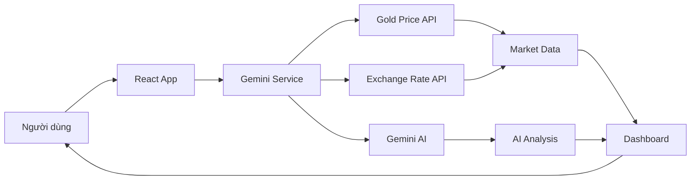
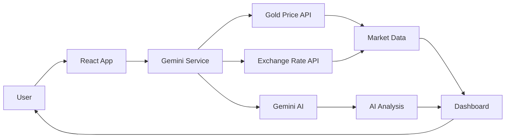

<div align="center">


# 📊 Gold Market Analyst

**Bảng điều khiển phân tích thị trường vàng thời gian thực được hỗ trợ bởi AI**

[](https://react.dev/)
[](https://www.typescriptlang.org/)
[](https://vitejs.dev/)
[](https://ai.google.dev/)

[English](#english) | [Tiếng Việt](#tiếng-việt)

</div>

---

## Tiếng Việt

### 🎯 Tổng Quan

**Gold Market Analyst** là ứng dụng phân tích thị trường vàng thời gian thực với sự hỗ trợ của trí tuệ nhân tạo Gemini 2.0 Flash. Ứng dụng cung cấp phân tích chuyên sâu về giá vàng thế giới (XAU/USD), vàng trong nước (SJC, PNJ, DOJI, BTMC), và các chỉ số kinh tế vĩ mô (DXY).

### ✨ Tính Năng Chính

#### 📈 Phân Tích Thị Trường
- **Giá vàng thời gian thực**: XAU/USD từ các nguồn dữ liệu uy tín
- **Vàng trong nước**: Theo dõi giá vàng SJC, PNJ, DOJI, BTMC, vàng nhẫn
- **Chỉ số vĩ mô**: Theo dõi US Dollar Index (DXY) và tỷ giá USD/VND
- **Biểu đồ tương tác**: Tích hợp TradingView widget cho phân tích kỹ thuật

#### 🤖 Phân Tích AI
- **Gemini 2.0 Flash**: Phân tích thị trường được hỗ trợ bởi AI tiên tiến của Google
- **Báo cáo tự động**: Tóm tắt kỹ thuật, vĩ mô, và xu hướng thị trường
- **Khuyến nghị giao dịch**: Đề xuất hành động MUA/BÁN/QUAN SÁT dựa trên phân tích đa chiều
- **Chat AI**: Tương tác với chatbot AI để giải đáp thắc mắc về thị trường

#### 📊 Chỉ Báo Kỹ Thuật
- **RSI** (Relative Strength Index): Đo lường động lực thị trường
- **Stochastic**: Xác định vùng quá mua/quá bán
- **MACD**: Phân tích xu hướng và động lượng
- **Bollinger Bands**: Đo độ biến động thị trường
- **ADX**: Đo sức mạnh xu hướng
- **CCI** (Commodity Channel Index): Xác định chu kỳ thị trường
- **Moving Averages** (MA50, MA200): Phân tích xu hướng dài hạn
- **Pivot Points**: Xác định các mức hỗ trợ/kháng cự
- **Fibonacci Levels**: Mức thoái lui và mở rộng Fibonacci

#### 🎨 Giao Diện & Trải Nghiệm
- **Responsive Design**: Tối ưu cho mọi thiết bị
- **Dark Theme**: Giao diện tối hiện đại, dễ nhìn
- **Biểu đồ trực quan**: Sử dụng Recharts cho visualization đẹp mắt
- **Export PDF/PNG**: Xuất báo cáo phân tích dạng PDF hoặc ảnh PNG
- **Auto-refresh**: Cập nhật dữ liệu tự động mỗi 2 phút
- **Toast Notifications**: Thông báo trạng thái cập nhật thời gian thực

#### 📰 Tin Tức & Insights
- **Tin tức thị trường**: Cập nhật tin tức ảnh hưởng đến giá vàng
- **Phân tích chênh lệch**: So sánh giá vàng trong nước và thế giới
- **Snapshot thị trường**: Tổng quan nhanh về trạng thái thị trường hiện tại

### 🛠️ Công Nghệ Sử Dụng

#### Frontend
- **React 19.2.4**: Thư viện UI hiện đại
- **TypeScript 5.8.2**: Type-safe development
- **Vite 6.2.0**: Build tool nhanh và hiệu quả

#### AI & APIs
- **Google Gemini 2.0 Flash**: AI model cho phân tích thị trường
- **TradingView**: Widget biểu đồ chuyên nghiệp
- **Gold Price API**: Dữ liệu giá vàng thời gian thực
- **Exchange Rate API**: Tỷ giá hối đoái

#### Visualization & Export
- **Recharts**: Thư viện biểu đồ React
- **html2canvas**: Chụp ảnh màn hình
- **jsPDF**: Tạo file PDF

### 🚀 Cài Đặt và Chạy

#### Yêu Cầu Hệ Thống
- **Node.js**: Version 16.x hoặc cao hơn
- **npm**: Version 7.x hoặc cao hơn
- **Gemini API Key**: Đăng ký tại [Google AI Studio](https://makersuite.google.com/app/apikey)

#### Các Bước Cài Đặt

1. **Clone repository**
   ```bash
   git clone https://github.com/phuongfullstack/gold-ai-analyst.git
   cd gold-ai-analyst
   ```

2. **Cài đặt dependencies**
   ```bash
   npm install
   ```

3. **Cấu hình API Key**
   
   Có 2 cách để cấu hình Gemini API Key:

   **Cách 1: Qua giao diện ứng dụng (Khuyến nghị)**
   - Chạy ứng dụng (bước 4)
   - Click vào icon ⚙️ Settings ở góc trên bên phải
   - Nhập Gemini API Key
   - Click "Save" (API key sẽ được lưu trong localStorage)

   **Cách 2: Qua file .env**
   - Tạo file `.env.local` trong thư mục gốc:
     ```bash
     echo "API_KEY=your_gemini_api_key_here" > .env.local
     ```
   - Thay `your_gemini_api_key_here` bằng API key thực của bạn

4. **Chạy ứng dụng**
   ```bash
   npm run dev
   ```

5. **Mở trình duyệt**
   
   Truy cập: `http://localhost:5173`

#### Build cho Production

```bash
npm run build
npm run preview
```

### 📖 Hướng Dẫn Sử Dụng

1. **Theo dõi giá**: Xem giá vàng thời gian thực trên các thẻ Price Card
2. **Phân tích kỹ thuật**: Kiểm tra các chỉ báo kỹ thuật trong phần Advanced Technicals
3. **Đọc báo cáo AI**: Xem phân tích chi tiết và khuyến nghị trong Analysis Panel
4. **Chat với AI**: Mở Chat Widget để đặt câu hỏi về thị trường
5. **Export báo cáo**: Sử dụng nút PDF hoặc PNG để xuất báo cáo
6. **Tùy chỉnh**: Click Settings để thay đổi API key hoặc cấu hình khác

### 🔄 Luồng Hoạt Động



### 📁 Cấu Trúc Dự Án

```
gold-ai-analyst/
├── components/           # React components
│   ├── PriceCard.tsx    # Hiển thị giá vàng
│   ├── MarketChart.tsx  # Biểu đồ giá
│   ├── AnalysisPanel.tsx # Báo cáo phân tích
│   ├── AdvancedTechnicals.tsx # Chỉ báo kỹ thuật
│   ├── LocalGoldTable.tsx # Bảng giá vàng trong nước
│   ├── ChatWidget.tsx   # AI chatbot
│   └── ...
├── services/            # API services
│   └── geminiService.ts # Gemini AI integration
├── utils/              # Utilities
│   ├── algorithms.ts   # Thuật toán tính toán
│   └── constants.ts    # Hằng số
├── contexts/           # React contexts
│   └── ToastContext.tsx # Toast notifications
├── types.ts           # TypeScript types
├── App.tsx            # Main app component
└── package.json       # Dependencies

```

### 🔐 Bảo Mật

- API keys được lưu trong localStorage (client-side)
- Không commit API keys vào repository
- Sử dụng HTTPS cho các API calls
- Validate và sanitize user inputs

### 🤝 Đóng Góp

Chúng tôi hoan nghênh mọi đóng góp! Vui lòng:

1. Fork repository
2. Tạo branch mới (`git checkout -b feature/AmazingFeature`)
3. Commit changes (`git commit -m 'Add some AmazingFeature'`)
4. Push to branch (`git push origin feature/AmazingFeature`)
5. Mở Pull Request

### 📝 License

Dự án này được phát hành dưới MIT License.

### 📞 Liên Hệ

- **Author**: Phuong Full Stack
- **GitHub**: [@phuongfullstack](https://github.com/phuongfullstack)
- **AI Studio**: [View App](https://ai.studio/apps/drive/1T7UDVloOzGYdw6mVGe0SN0LyvcQ5LtdW)

---

## English

### 🎯 Overview

**Gold Market Analyst** is a real-time gold market analysis application powered by Google's Gemini 2.0 Flash AI. The application provides in-depth analysis of global gold prices (XAU/USD), local Vietnamese gold prices (SJC, PNJ, DOJI, BTMC), and macroeconomic indicators (DXY).

### ✨ Key Features

#### 📈 Market Analysis
- **Real-time gold prices**: XAU/USD from trusted data sources
- **Local gold prices**: Track SJC, PNJ, DOJI, BTMC, and ring gold prices
- **Macro indicators**: Monitor US Dollar Index (DXY) and USD/VND exchange rate
- **Interactive charts**: Integrated TradingView widget for technical analysis

#### 🤖 AI-Powered Analysis
- **Gemini 2.0 Flash**: Market analysis powered by Google's advanced AI
- **Automated reports**: Technical, macro, and market trend summaries
- **Trading recommendations**: BUY/SELL/WATCH action suggestions based on multi-dimensional analysis
- **AI Chat**: Interact with AI chatbot for market insights

#### 📊 Technical Indicators
- **RSI** (Relative Strength Index): Measure market momentum
- **Stochastic**: Identify overbought/oversold zones
- **MACD**: Trend and momentum analysis
- **Bollinger Bands**: Market volatility measurement
- **ADX**: Trend strength measurement
- **CCI** (Commodity Channel Index): Identify market cycles
- **Moving Averages** (MA50, MA200): Long-term trend analysis
- **Pivot Points**: Support/resistance level identification
- **Fibonacci Levels**: Fibonacci retracement and extension levels

#### 🎨 UI & Experience
- **Responsive Design**: Optimized for all devices
- **Dark Theme**: Modern dark interface, easy on the eyes
- **Visual Charts**: Beautiful visualization using Recharts
- **Export PDF/PNG**: Export analysis reports as PDF or PNG
- **Auto-refresh**: Automatic data updates every 2 minutes
- **Toast Notifications**: Real-time status notifications

#### 📰 News & Insights
- **Market news**: Updates on news affecting gold prices
- **Spread analysis**: Compare local and international gold prices
- **Market snapshot**: Quick overview of current market status

### 🛠️ Technology Stack

#### Frontend
- **React 19.2.4**: Modern UI library
- **TypeScript 5.8.2**: Type-safe development
- **Vite 6.2.0**: Fast and efficient build tool

#### AI & APIs
- **Google Gemini 2.0 Flash**: AI model for market analysis
- **TradingView**: Professional charting widget
- **Gold Price API**: Real-time gold price data
- **Exchange Rate API**: Currency exchange rates

#### Visualization & Export
- **Recharts**: React charting library
- **html2canvas**: Screen capture
- **jsPDF**: PDF generation

### 🚀 Installation and Setup

#### System Requirements
- **Node.js**: Version 16.x or higher
- **npm**: Version 7.x or higher
- **Gemini API Key**: Register at [Google AI Studio](https://makersuite.google.com/app/apikey)

#### Installation Steps

1. **Clone the repository**
   ```bash
   git clone https://github.com/phuongfullstack/gold-ai-analyst.git
   cd gold-ai-analyst
   ```

2. **Install dependencies**
   ```bash
   npm install
   ```

3. **Configure API Key**
   
   There are 2 ways to configure the Gemini API Key:

   **Method 1: Via application UI (Recommended)**
   - Run the application (step 4)
   - Click the ⚙️ Settings icon in the top right corner
   - Enter your Gemini API Key
   - Click "Save" (API key will be stored in localStorage)

   **Method 2: Via .env file**
   - Create a `.env.local` file in the root directory:
     ```bash
     echo "API_KEY=your_gemini_api_key_here" > .env.local
     ```
   - Replace `your_gemini_api_key_here` with your actual API key

4. **Run the application**
   ```bash
   npm run dev
   ```

5. **Open browser**
   
   Navigate to: `http://localhost:5173`

#### Build for Production

```bash
npm run build
npm run preview
```

### 📖 Usage Guide

1. **Monitor prices**: View real-time gold prices on Price Cards
2. **Technical analysis**: Check technical indicators in Advanced Technicals section
3. **Read AI reports**: View detailed analysis and recommendations in Analysis Panel
4. **Chat with AI**: Open Chat Widget to ask questions about the market
5. **Export reports**: Use PDF or PNG buttons to export reports
6. **Customize**: Click Settings to change API key or other configurations

### 🔄 Workflow



### 📁 Project Structure

```
gold-ai-analyst/
├── components/           # React components
│   ├── PriceCard.tsx    # Gold price display
│   ├── MarketChart.tsx  # Price charts
│   ├── AnalysisPanel.tsx # Analysis reports
│   ├── AdvancedTechnicals.tsx # Technical indicators
│   ├── LocalGoldTable.tsx # Local gold price table
│   ├── ChatWidget.tsx   # AI chatbot
│   └── ...
├── services/            # API services
│   └── geminiService.ts # Gemini AI integration
├── utils/              # Utilities
│   ├── algorithms.ts   # Calculation algorithms
│   └── constants.ts    # Constants
├── contexts/           # React contexts
│   └── ToastContext.tsx # Toast notifications
├── types.ts           # TypeScript types
├── App.tsx            # Main app component
└── package.json       # Dependencies
```

### 🔐 Security

- API keys stored in localStorage (client-side)
- Never commit API keys to repository
- Use HTTPS for API calls
- Validate and sanitize user inputs

### 🤝 Contributing

We welcome all contributions! Please:

1. Fork the repository
2. Create a new branch (`git checkout -b feature/AmazingFeature`)
3. Commit your changes (`git commit -m 'Add some AmazingFeature'`)
4. Push to the branch (`git push origin feature/AmazingFeature`)
5. Open a Pull Request

### 📝 License

This project is released under the MIT License.

### 📞 Contact

- **Author**: Phuong Full Stack
- **GitHub**: [@phuongfullstack](https://github.com/phuongfullstack)
- **AI Studio**: [View App](https://ai.studio/apps/drive/1T7UDVloOzGYdw6mVGe0SN0LyvcQ5LtdW)

---

<div align="center">
Made with ❤️ by Phuong Full Stack | Powered by Google Gemini AI
</div>
